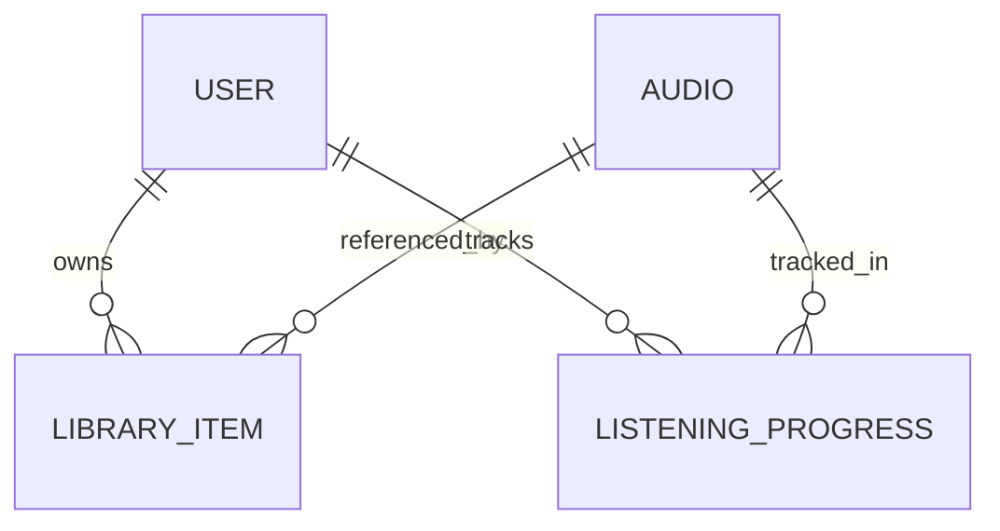

# 🎧 Audio Streaming Platform (Fonos-like Backend)

A **backend-focused audio streaming platform** inspired by Fonos / Audible.
This project is intentionally designed as a **system design & backend engineering showcase**, not a full product.

> **Goal:** demonstrate clean backend architecture, security design, and streaming fundamentals in an interview-ready format.


## 📌 Project Overview

This project implements the core backend capabilities of an audio streaming platform:

* Secure user authentication with JWT + refresh token rotation
* Audio catalog with free & premium content
* HTTP Range–based audio streaming (seek & resume)
* Listening progress tracking
* User library management
* Full-text search using PostgreSQL

The system is implemented as a **modular monolith**, emphasizing clear boundaries and future scalability.


## 🎯 Project Goals

* Focus on **backend architecture & business logic**
* Demonstrate **secure authentication design**
* Support **HTTP Range Requests** for audio streaming
* Enable **resume listening** functionality
* Maintain **clean separation of responsibilities**
* Be **interview-ready** in both design and documentation


## ❌ Non-Goals (Out of Scope)

The following are intentionally excluded to keep the scope focused:

* Frontend UI
* Payment & subscription billing
* Offline audio downloads
* Recommendation system
* Microservice deployment (future consideration only)


## 🧩 Core Features

* **Authentication & Authorization**

  * JWT access tokens
  * Stateful refresh tokens with rotation
  * Role-based access control (FREE / PREMIUM / ADMIN)

* **Audio Management**

  * Audio metadata
  * Premium access enforcement

* **Audio Streaming**

  * HTTP Range Requests (`206 Partial Content`)
  * Seek & resume support

* **Listening Progress**

  * Track last listened position per user & audio

* **User Library**

  * Add / remove audio
  * Persistent ownership tracking

* **Search**

  * PostgreSQL full-text search using `tsvector`


## 🏗️ Architecture

### Modular Monolith

This project follows a **Modular Monolith** architecture.

* Strong module boundaries
* Shared database
* Single deployable unit
* Mirrors future microservice boundaries without distributed complexity

```text
Controller
  ↓
Service (Business Logic)
  ↓
Domain Model
  ↓
Repository (JPA)
  ↓
PostgreSQL
```

> A modular monolith provides transactional consistency and simpler operations 
> while maintaining clean separation of concerns.  

➡️ **Detailed architecture decisions, module boundaries, and design rationale:**  
➡️ See [docs/architecture.md](docs/architecture.md)


## 📦 Package Structure (High-Level)

Each top-level package represents a **bounded context**.

```text
dev.hazoe.audiostreaming
├── auth        # authentication & security
├── audio       # audio catalog & access rules
├── library     # user-owned audio items
├── progress    # resume listening
├── search      # full-text search
├── common      # shared utilities
├── config
└── AudiostreamingApplication.java
```

> Each module internally follows a layered structure
> (`controller / service / domain / repository`).


## 🧠 Domain Model Philosophy

Domain entities are implemented as **JPA entities** and represent persistence state.

* The domain model is currently **anemic by design**
* Focus is on infrastructure correctness (security, streaming, persistence)
* Business logic can be enriched as requirements grow

> This is a conscious trade-off to avoid duplicate models and unnecessary abstraction.


## 🧠 Domain Model (ERD)




## 🗄️ Database Schema

### User

* id (PK)
* email (unique)
* password_hash
* role (FREE | PREMIUM | ADMIN)
* created_at

### Audio

* id (PK)
* title
* description
* duration_seconds
* audio_path
* content_type
* cover_path
* is_premium
* search_vector (tsvector)
* owner_id (FK → User.id)
* created_at

### Library Item

* id (PK)
* user_id (FK → users)
* audio_id (FK → audio)
* saved_at
* UNIQUE(user_id, audio_id)

### Listening Progress

* id (PK)
* user_id (FK → users)
* audio_id (FK → audio)
* last_position_seconds
* updated_at
* UNIQUE(user_id, audio_id)

### Refresh Token

* id (PK)
* token (unique)
* user_id (FK → users)
* expires_at
* created_at


## 🗄️ Database Design (Overview)

* PostgreSQL as the primary datastore
* Relational schema with explicit constraints
* `BIGINT` primary keys managed by JPA
* Indexed for user-centric access patterns
* Join tables modeled explicitly as entities (e.g. `LIBRARY_ITEM`)

➡️ See [docs/database.md](docs/database.md) for full schema and design rationale.


## 🔌 API Contract (Frozen Scope)

### Authentication

```
POST /api/auth/register
POST /api/auth/login
POST /api/auth/refresh
```

### Audio

```
GET /api/audios
GET /api/audios/{id}
GET /api/audios/{id}/stream
```

### Library

```
POST   /api/library/{audioId}
DELETE /api/library/{audioId}
GET    /api/library
```

### Listening Progress

```
POST /api/progress
GET  /api/progress/{audioId}
```

```json
{
  "audioId": 1,
  "positionSeconds": 120
}
```

### Search

```
GET /api/search?keyword=sony
```

➡️ Full API details: [docs/api.md](docs/api.md)


## 🔐 Authentication & Security (Overview)

- JWT access tokens (stateless, short-lived)
- Stateful refresh tokens with rotation
- Role-based authorization
- Token type enforcement (ACCESS vs REFRESH)

➡️ See [docs/authentication.md](docs/authentication.md) for detailed flows.


## 🎵 Audio Streaming Design

* HTTP Range Requests
* Seek & resume support
* Partial content delivery (`206 Partial Content`)
* Authorization validated **before streaming begins**

➡️ **Streaming flow & HTTP semantics:**  
➡️ See [docs/streaming.md](docs/streaming.md)


## 📚 User Library

Authenticated users can manage a personal audio library.

Key characteristics:

* User-scoped ownership of saved audio
* Explicit join modeling (`library_item`)
* Independent of streaming and resume listening
* Idempotent add/remove operations

➡️ See: [docs/library.md](docs/library.md)


## 🎧 Resume Listening

The system supports resuming audio playback from the last listened position.

Key characteristics:
- User-scoped and audio-scoped progress
- Stateless streaming using HTTP Range
- Progress persistence decoupled from streaming

➡️ See: [docs/resume-listening.md](docs/resume-listening.md)


## 🔍 Search Design

* PostgreSQL full-text search using `tsvector`
* GIN index for efficient keyword lookup
* `search_vector` is maintained by the database as a generated column, avoiding application-level coupling

> PostgreSQL full-text search is sufficient for the current scale and requirements.  
> This avoids premature complexity while preserving a clear migration path to Elasticsearch in the future.


➡️ See: [docs/search.md](docs/search.md)

## 📎 Notes

This project is **not a startup MVP**.  
It is a **backend engineering portfolio piece**, optimized for:

* Code review discussions
* System design interviews
* Security & architecture walkthroughs


### 📚 Documentation Index

* Architecture: [`docs/architecture.md`](docs/architecture.md)
* Authentication: [`docs/authentication.md`](docs/authentication.md)
* Streaming: [`docs/streaming.md`](docs/streaming.md)
* Database: [`docs/database.md`](docs/database.md)
* API: [`docs/api.md`](docs/api.md)


## 🚀 Future Improvements

* Extract streaming into a dedicated service
* Add caching for audio metadata
* Event-driven progress updates
* CI/CD pipeline
* Optimistic locking on progress updates


## 📅 Development Plan

The project was developed incrementally in the following order:

1. System design (ERD, schema, API contracts)
2. Authentication & security
3. Audio management
4. Audio streaming
5. User library
6. Resume listening
7. Search
8. Deployment
