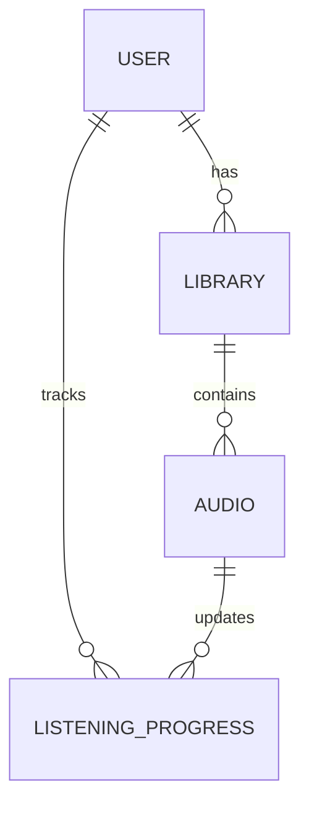

```
✔ ERD (domain model)
✔ DB schema (SQL)
✔ API contract (đóng băng scope)
```
---


# 🎧 Audio Streaming Platform (Fonos-like Backend)

A backend-focused audio streaming platform inspired by Fonos/Audible.
This project is designed primarily for backend system design and interview demonstration.

---

## 🎯 Project Goals

- Focus on backend architecture and business logic
- Support audio streaming with HTTP Range Requests
- Resume listening functionality
- Clear separation of responsibilities (modular monolith)
- Interview-ready documentation and design

---

## ❌ Non-goals (Out of Scope)

- Frontend UI
- Payment integration
- Offline download
- Recommendation system
- Microservice implementation (future consideration only)

---

## 🧩 Core Features

- User authentication (JWT)
- Audio catalog (free & premium)
- Audio streaming with seek support
- Resume listening progress
- User library
- Full-text search

---

## 📐 System Architecture

This project follows a **Modular Monolith** architecture.

```

Controller
↓
Service (Business Logic)
↓
Domain Model
↓
Repository (JPA)
↓
PostgreSQL

```

---

## 🧠 Domain Model (ERD)



---

## 🗄️ Database Schema

### User
- id (PK)
- email (unique)
- password_hash
- role (FREE | PREMIUM | ADMIN)
- created_at

### Audio
- id (PK)
- title
- description
- duration_seconds
- audio_url
- cover_url
- is_premium
- search_vector (tsvector)
- created_at

### Library
- id (PK)
- user_id (FK → User)
- audio_id (FK → Audio)
- created_at
- UNIQUE(user_id, audio_id)

### Listening Progress
- id (PK)
- user_id (FK → User)
- audio_id (FK → Audio)
- last_position_seconds
- updated_at
- UNIQUE(user_id, audio_id)

---

## 🧪 Initial SQL Schema (Flyway V1)

```sql
CREATE TABLE users (
    id BIGSERIAL PRIMARY KEY,
    email VARCHAR(255) UNIQUE NOT NULL,
    password_hash VARCHAR(255) NOT NULL,
    role VARCHAR(20) NOT NULL,
    created_at TIMESTAMP DEFAULT now()
);

CREATE TABLE audio (
    id BIGSERIAL PRIMARY KEY,
    title VARCHAR(255) NOT NULL,
    description TEXT,
    duration_seconds INT NOT NULL,
    audio_url TEXT NOT NULL,
    cover_url TEXT,
    is_premium BOOLEAN DEFAULT FALSE,
    search_vector tsvector,
    created_at TIMESTAMP DEFAULT now()
);

CREATE TABLE library (
    id BIGSERIAL PRIMARY KEY,
    user_id BIGINT REFERENCES users(id),
    audio_id BIGINT REFERENCES audio(id),
    created_at TIMESTAMP DEFAULT now(),
    UNIQUE(user_id, audio_id)
);

CREATE TABLE listening_progress (
    id BIGSERIAL PRIMARY KEY,
    user_id BIGINT REFERENCES users(id),
    audio_id BIGINT REFERENCES audio(id),
    last_position_seconds INT NOT NULL,
    updated_at TIMESTAMP DEFAULT now(),
    UNIQUE(user_id, audio_id)
);
````

---

## 🔌 API Contract (Frozen Scope)

### Authentication

```
POST /api/auth/register
POST /api/auth/login
POST /api/auth/refresh
```

---

### Audio

```
GET /api/audios
GET /api/audios/{id}
GET /api/audios/{id}/stream
```

---

### Library

```
POST   /api/library/{audioId}
DELETE /api/library/{audioId}
GET    /api/library
```

---

### Listening Progress

```
POST /api/progress
GET  /api/progress/{audioId}
```

Request body:

```json
{
  "audioId": 1,
  "positionSeconds": 120
}
```

---

### Search

```
GET /api/search?keyword=sony
```

---

## 🚀 Future Improvements

* Extract audio-streaming into a dedicated microservice
* Add caching for audio metadata
* Event-driven progress tracking
* CI/CD pipeline

---

## 📅 Development Plan

- Step 1: System design (ERD, DB schema, API contract)
- Step 2: Authentication & Security
- Step 3: Audio management
- Step 4: Audio streaming
- Step 5: Library
- Step 6: Resume listening
- Step 7: Search
- Step 8: Deployment


