# Audio Streaming Platform — Component Diagrams

## 1. System Architecture Overview

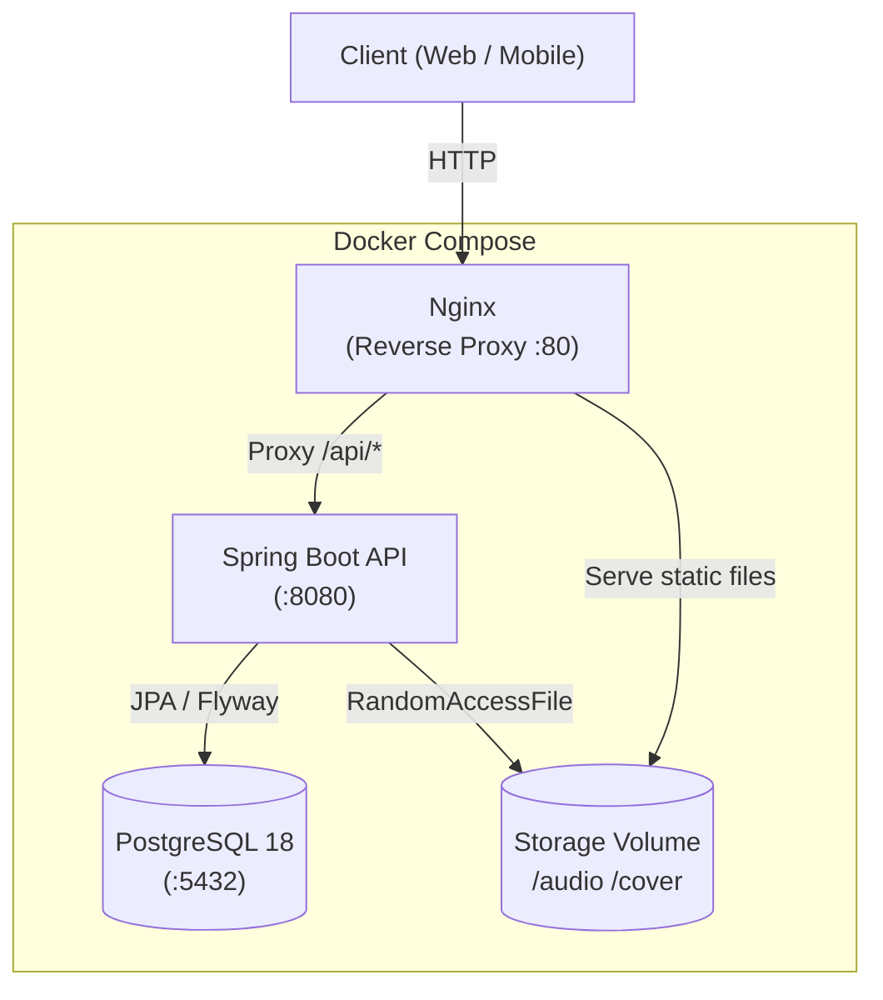

---

## 2. Module Dependency Map

### 2a. Layer Overview

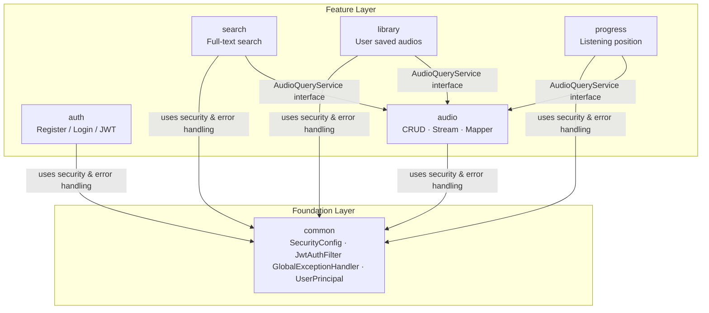

### 2b. Internal Module Detail

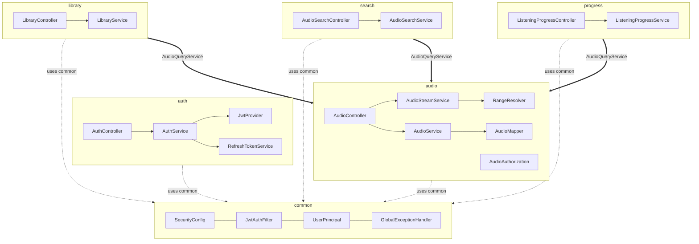

---

## 3. Entity Relationship Diagram

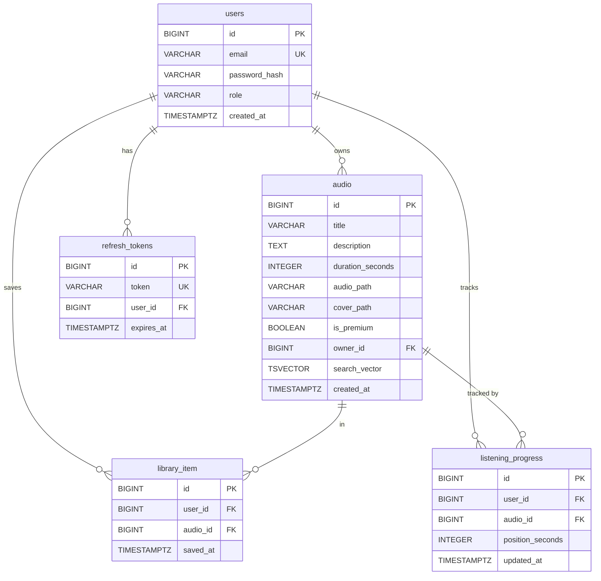

---

## 4. Authentication Flow

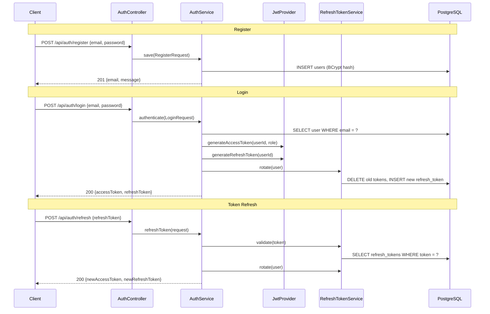

---

## 5. Request Authorization Flow

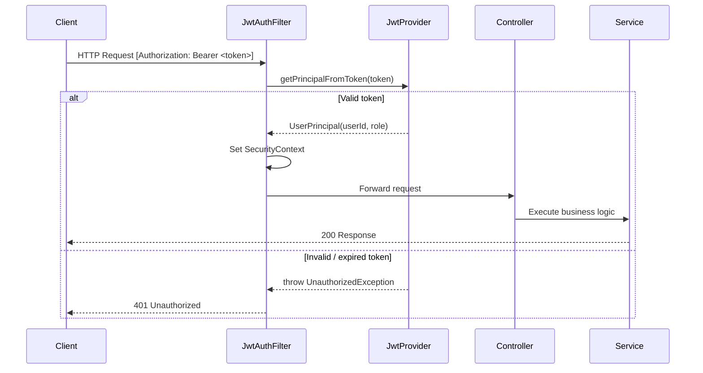

---

## 6. Audio Streaming Flow

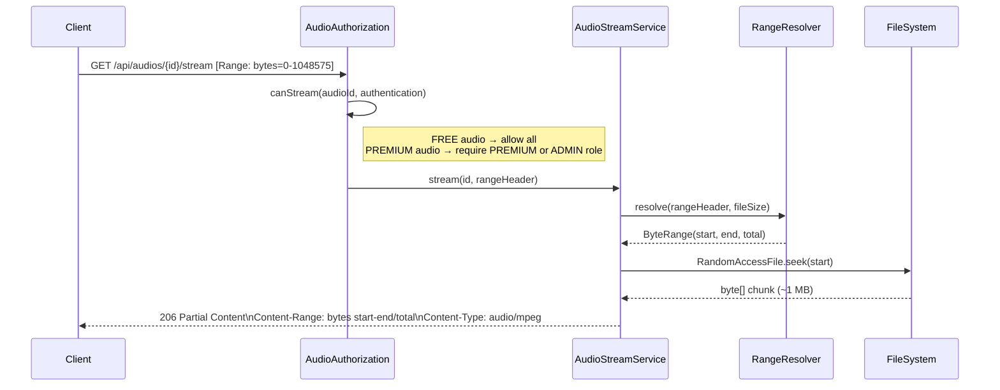

---

## 7. Full-Text Search Flow

### 7a. Request Pipeline

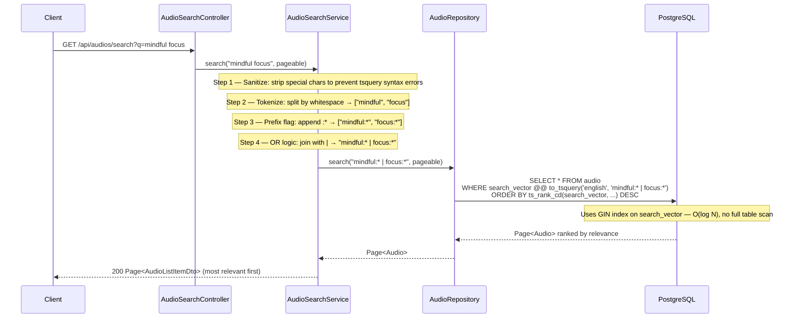

### 7b. FTS Key Benefits vs LIKE

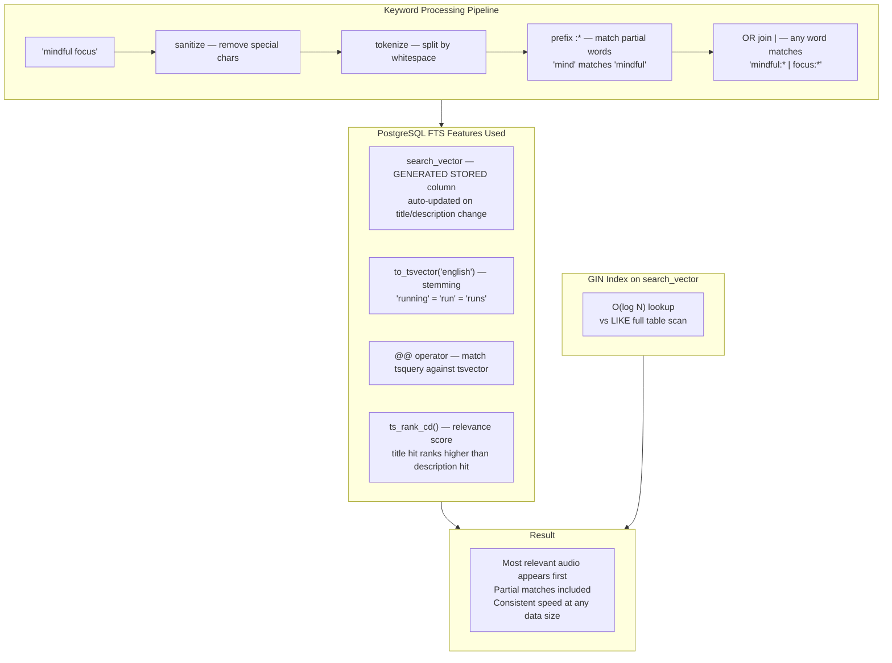

---

## 8. API Endpoint Map

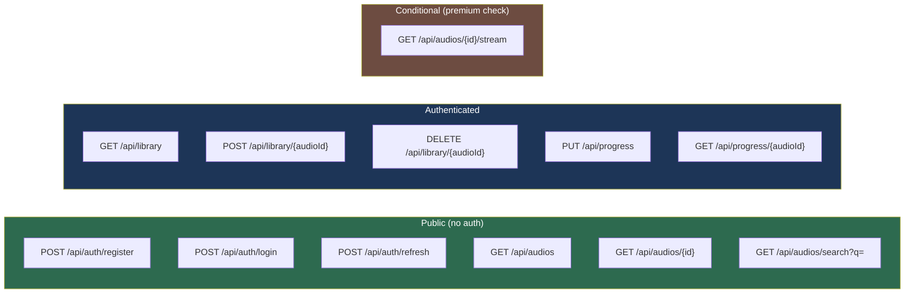

---

## 9. List Audios (Paginated)

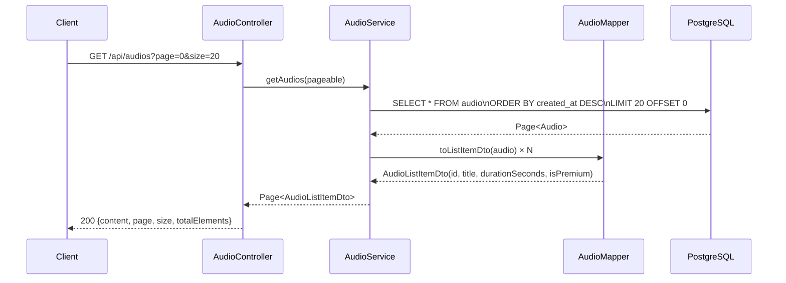

---

## 10. Get Audio Detail

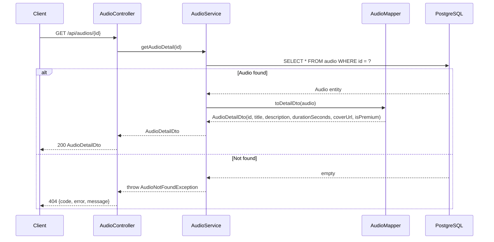

---

## 11. Save Audio to Library

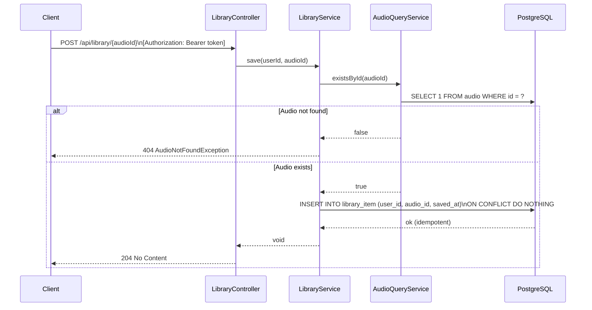

---

## 12. List User Library

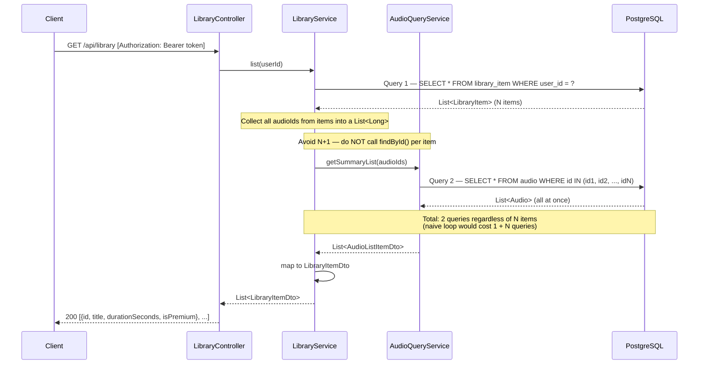

---

## 13. Remove Audio from Library

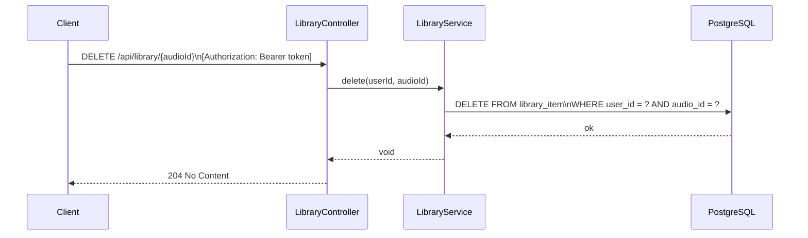

---

## 14. Save / Update Listening Progress

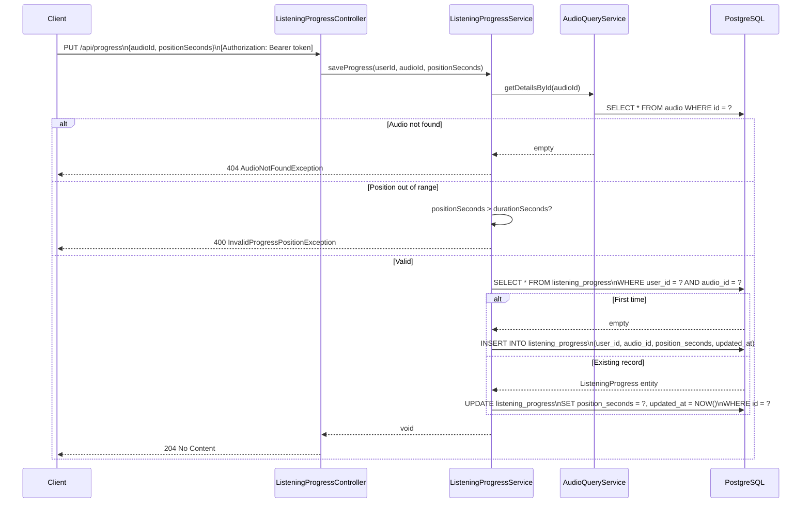

---

## 15. Get Listening Progress

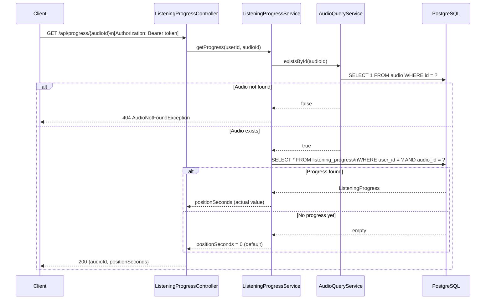

---

## 16. Deployment Architecture

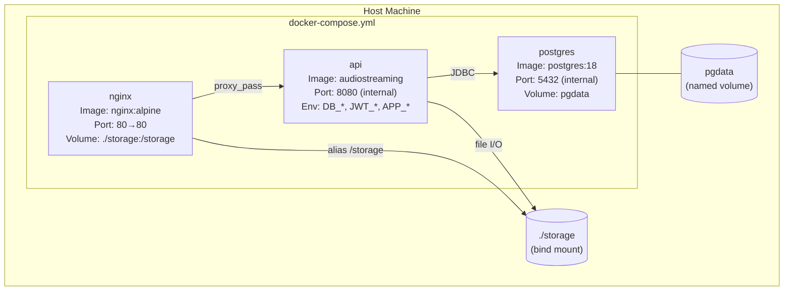
