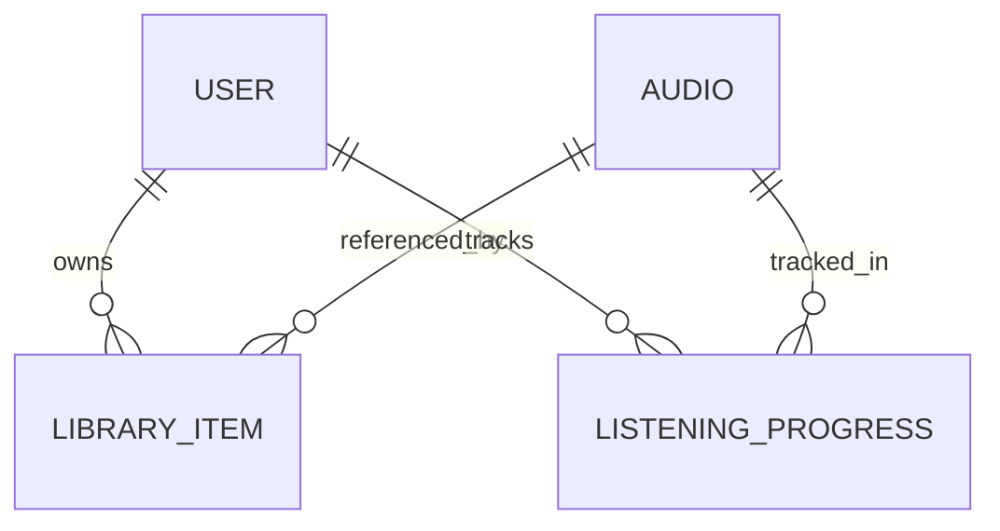

# Database Design

This document describes the database design for the **Audio Streaming Platform** backend, including schema structure, entity relationships, primary key strategy, indexing, and ORM integration decisions.

The system uses **PostgreSQL** as its primary datastore and **JPA (Hibernate)** as the ORM layer, with **Flyway** for schema migrations.

---

## 1. Design Principles

The database design follows these principles:

* Relational, normalized schema
* Strong referential integrity via foreign keys
* ORM-driven schema ownership (JPA as the source of truth)
* Explicit constraints and indexes
* Minimal database-side logic (no stored procedures or triggers)

The database acts strictly as a **persistence layer**, not a business logic layer.

---

## 2. Primary Key Strategy

All entities use `BIGINT` as their primary key type.

### Rationale

* Matches Java `Long`
* Scales well for large datasets
* Avoids database-specific pseudo-types (e.g. `BIGSERIAL`)
* Keeps ID generation consistent across environments

### ID Generation

Primary keys are generated by JPA using:

```java
@GeneratedValue(strategy = GenerationType.IDENTITY)
```

In PostgreSQL, this corresponds to:

```sql
id BIGINT GENERATED ALWAYS AS IDENTITY
```

ID lifecycle management is owned by the ORM.
The database does **not** contain business logic related to ID generation.

---

## 3. Entity Relationship Overview (ERD)



### Notes

* `LIBRARY_ITEM` is a **first-class entity**, not a pure join table
* Ownership relationships are modeled explicitly
* One `(user, audio)` pair maps to one library item and one progress record

---

## 4. Table Definitions

### 4.1 Users

Represents authenticated users of the platform.

```sql
CREATE TABLE users (
    id BIGINT PRIMARY KEY GENERATED ALWAYS AS IDENTITY,
    email VARCHAR(255) NOT NULL UNIQUE,
    password_hash VARCHAR(255) NOT NULL,
    role VARCHAR(20) NOT NULL,
    created_at TIMESTAMP NOT NULL DEFAULT now()
);
```

**Notes:**

* `email` is unique and used for authentication
* `role` is stored as `VARCHAR` to align with `EnumType.STRING`
* No personal data beyond authentication requirements

---

### 4.2 Audio

Stores audio metadata and streaming references.

```sql
CREATE TABLE audio (
    id BIGINT PRIMARY KEY GENERATED ALWAYS AS IDENTITY,
    title VARCHAR(255) NOT NULL,
    description TEXT,
    duration_seconds INT NOT NULL,
    audio_path TEXT NOT NULL,
    cover_path TEXT,
    is_premium BOOLEAN NOT NULL DEFAULT FALSE,
    search_vector tsvector,
    user_id BIGINT NOT NULL,
    created_at TIMESTAMP NOT NULL DEFAULT now(),
    CONSTRAINT fk_audio_user
        FOREIGN KEY (user_id) REFERENCES users(id)
);

```

**Notes:**

- Audio binaries are stored externally (file system or object storage).
- The database stores metadata only, enabling efficient streaming and scaling.
- `search_vector` is used to support PostgreSQL full-text search.

---

### 4.3 Library Item

Represents a **user-owned audio item**.

```sql
CREATE TABLE library_item (
    id BIGINT PRIMARY KEY GENERATED ALWAYS AS IDENTITY,
    user_id BIGINT NOT NULL,
    audio_id BIGINT NOT NULL,
    created_at TIMESTAMP NOT NULL DEFAULT now(),
    CONSTRAINT fk_library_item_user FOREIGN KEY (user_id) REFERENCES users(id),
    CONSTRAINT fk_library_item_audio FOREIGN KEY (audio_id) REFERENCES audio(id),
    CONSTRAINT uq_library_item_user_audio UNIQUE (user_id, audio_id)
);
```

**Notes:**

* Models ownership explicitly
* Prevents duplicate ownership records
* Designed as a domain entity, not a bare join table
* Can be extended with additional metadata in the future

---

### 4.4 Listening Progress

Tracks resume-listening position per user and audio.

```sql
CREATE TABLE listening_progress (
    id BIGINT PRIMARY KEY GENERATED ALWAYS AS IDENTITY,
    user_id BIGINT NOT NULL,
    audio_id BIGINT NOT NULL,
    last_position_seconds INT NOT NULL,
    updated_at TIMESTAMP NOT NULL DEFAULT now(),
    CONSTRAINT fk_progress_user FOREIGN KEY (user_id) REFERENCES users(id),
    CONSTRAINT fk_progress_audio FOREIGN KEY (audio_id) REFERENCES audio(id),
    CONSTRAINT uq_progress_user_audio UNIQUE (user_id, audio_id)
);
```

**Notes:**

* One progress record per `(user, audio)`
* Updated frequently during playback
* Enables accurate resume functionality

---

### 4.5 Refresh Tokens

Stores long-lived refresh tokens for JWT rotation and revocation.

```sql
CREATE TABLE refresh_tokens (
    id BIGINT PRIMARY KEY GENERATED ALWAYS AS IDENTITY,
    token TEXT NOT NULL UNIQUE,
    user_id BIGINT NOT NULL,
    expires_at TIMESTAMP NOT NULL,
    created_at TIMESTAMP NOT NULL DEFAULT now(),
    CONSTRAINT fk_refresh_token_user FOREIGN KEY (user_id) REFERENCES users(id)
);
```

**Notes:**

* Refresh tokens are stateful
* Enables revocation and reuse detection
* Tokens are rotated on every refresh request

---

## 5. Indexing Strategy

Indexes are designed around **user-centric access patterns**.

### Implicit Indexes

* Primary keys
* Unique constraints

### Explicit / Logical Indexes

| Table              | Column(s)           | Purpose          |
| ------------------ | ------------------- | ---------------- |
| users              | email (UNIQUE)      | Authentication   |
| library_item       | (user_id, audio_id) | Library lookup   |
| listening_progress | (user_id, audio_id) | Resume playback  |
| audio              | search_vector (GIN) | Full-text search |

Indexes are defined via:

* JPA annotations, or
* Flyway migrations where necessary

---

## 6. Full-Text Search

The `audio.search_vector` column uses PostgreSQL `tsvector` to support:

* Keyword search
* Ranked results
* Language-aware tokenization

The application layer is responsible for:

* Updating the search vector
* Executing search queries

No database triggers are used to avoid hidden behavior.

---

## 7. ORM & Migration Strategy

### ORM (JPA / Hibernate)

* Entities define schema structure
* Enums persisted using `EnumType.STRING`
* Lazy loading by default
* Anemic domain model by design

### Flyway

* Manages schema evolution
* One migration per logical change
* Used in development, testing, and CI

Production schema is always reproducible from migrations.

---

## 8. Trade-offs & Decisions

| Decision                   | Trade-off                       |
| -------------------------- | ------------------------------- |
| JPA-managed IDs            | Less DB-specific optimization   |
| Explicit ownership entity  | Slightly more tables            |
| No DB triggers             | More logic in application layer |
| No audio blobs in database | Requires external storage       |
| Anemic domain model        | Easier evolution, less coupling |

---

## 9. Summary

* PostgreSQL as relational datastore
* JPA as schema authority
* Flyway for migrations
* `BIGINT` primary keys
* Explicit ownership modeling via `LIBRARY_ITEM`
* Strong constraints and indexing
* Database focused on persistence, not business rules

This design prioritizes **clarity, correctness, and long-term maintainability**, while remaining **interview-ready**.

---

